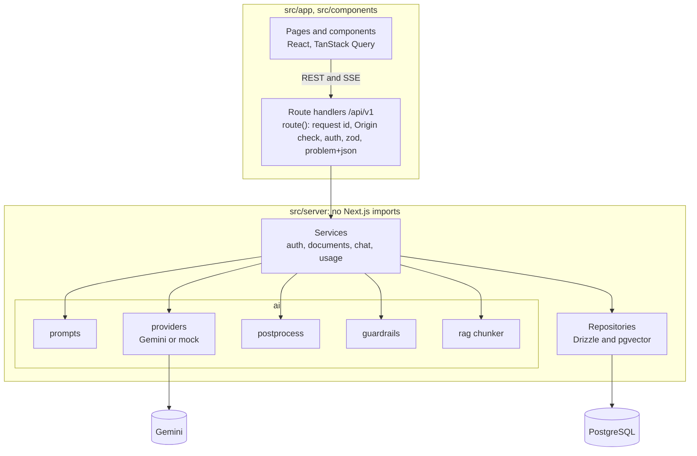
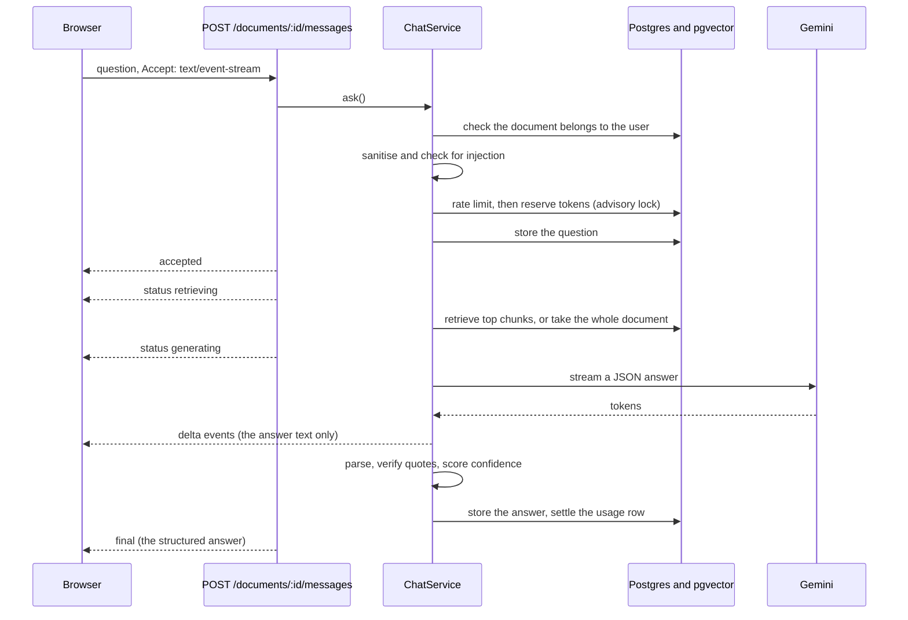

# AI Document Q&A

Ask questions about your documents and get answers you can check. The model is told to back every claim with a quote, and the server verifies each quote it is given against the document before it shows a confidence level.

Built for the Full Stack AI Engineer assessment: Next.js and TypeScript, PostgreSQL with pgvector, Gemini, and AWS infrastructure as validated Terraform. It runs end to end with **no API key**, on an offline mock model.

**Contents:** [Run it locally](#run-it-locally) · [Architecture decisions](#architecture-decisions) · [AI design choices](#ai-design-choices) · [Trade-offs and known limitations](#trade-offs-and-known-limitations)

> **Honest status.** No Gemini API key was available where this was built. The Gemini adapters are verified against the SDK's types and with stubbed clients, and everything else runs against a deterministic mock model. Two commands measure what that leaves open (answer quality, real token counts, latency); they are in [Using the real model](#using-the-real-model-gemini). The evaluation in CI proves the plumbing around the model, not the quality of its answers.

## Screenshots

Taken from the production build on the offline mock model, so the answer text is the mock's, not Gemini's.


## Run it locally

Prerequisites: Node 22 (`.nvmrc`) and Docker with Compose v2. No API key is needed.

### Quick start (mock model)

```bash
nvm use                         # Node 22 (.nvmrc)
npm ci
npm run setup                   # creates .env with a generated JWT secret (LLM_PROVIDER=mock needs no API key)
docker compose up -d db         # Postgres 17 + pgvector on 127.0.0.1:5432
npm run db:migrate              # applies ./drizzle (enables pgvector, creates tables)
npm run dev                     # http://localhost:3000
```

Port 3000 or 5432 already taken? Run the app on another port with `PORT=3100 APP_ORIGIN=http://localhost:3100 npm run dev` (`APP_ORIGIN` must be the URL you actually open: the cross-site check compares it with the browser's `Origin`, and an https origin turns on the Secure cookie). For Postgres, set `DB_HOST_PORT` and use the same port in `DATABASE_URL`.

Every setting is an environment variable, checked at boot by [`env.ts`](src/server/core/config/env.ts), which also holds the defaults; [`.env.example`](.env.example) lists the ones worth changing locally.

**Try it.**

1. Open http://localhost:3000 and create an account.
2. Add a document. The quickest way is **Use a sample document** and then **Add document** (a short, invented handbook). Or paste text, or upload [`evals/fixtures/handbook.md`](evals/fixtures/handbook.md) (a fictional 13 KB handbook, big enough to need retrieval) or [`scripts/fixtures/sample-policy.pdf`](scripts/fixtures/sample-policy.pdf) (three pages, so citations show page numbers).
3. Click a starter question, or ask "How many vacation days do I earn per month?", and open a source marker (`S1`) in the answer to see the quote it came from. Then ask something unrelated ("What is the capital of France?") and see the "not found" state.

The mock model is extractive: it answers with the best-matching sentence, so its quotes really verify, but it cannot paraphrase or reason. A request for the gist is answered from the opening sentences of the document, but only when it shares no word with the text (try the starter question "Summarize this document in a few sentences."); otherwise it answers with the best-matching sentence. It also answers an off-topic question with an unrelated sentence whenever a single word overlaps (try "Who founded the company?"), and the badge then still says the quote was verified. That is why "verified" is worded narrowly: the quote exists in the text, which is not the same as the answer being true. A real model is expected to decline such questions, and the `not_found` cases of `npm run eval -- --provider gemini` measure that. The mock streams slowly on purpose (40 ms a chunk) so the stages and the Stop button can be seen; `MOCK_LLM_CHUNK_DELAY_MS=1` makes it near-instant (the allowed range is 1 to 5000) and `300` gives more time to press Stop.

### Using the real model (Gemini)

1. Create a key in Google AI Studio. Use a **paid-tier** project for anything real: Google's terms say unpaid-tier prompts and responses may be used to improve its products and reviewed by people, while paid-tier content is not (both tiers keep prompts for a limited time for abuse monitoring).
2. Put it in `.env` yourself (it is gitignored; never paste it into chat or commit it): `LLM_PROVIDER=gemini` and `GEMINI_API_KEY=...`. The default model is `gemini-3.8-flash`; set `LLM_MODEL=gemini-3.5-flash` to compare.
3. Check the live path: `npm run smoke:gemini` (streaming, thinking-token accounting, embedding batching).
4. Measure it: `npm run eval -- --provider gemini --prompt v1,v2 --repeats 3` prints quality metrics, token counts and cost per configuration side by side. Other flags: `--model gemini-3.8-flash,gemini-3.5-flash` compares models, `--seed 7` repeats an output where the model supports it, `--cases id,id` runs a subset, `--update-baseline` records the current results, and `--no-fail` only prints. Every run writes a JSON report to `evals/reports/` (ignored by git).

### Everything in containers

```bash
docker compose --profile full up --build   # db + migrations + production image on http://localhost:3000
                                           # (Compose reads JWT_SECRET from the .env that `npm run setup` creates)
```

### Checks

```bash
npm run check                   # typecheck, lint, unit and component tests
npm run test:integration        # needs the db container; covers the SQL that fakes cannot prove
npm run eval                    # golden questions against the offline mock (checks the plumbing)
BASE_URL=http://localhost:3000 scripts/smoke-auth.sh   # curl walkthrough of the auth API
BASE_URL=http://localhost:3000 scripts/smoke-api.sh    # documents, answers, isolation between users
```

### Terraform checks (no AWS account needed)

```bash
cd infra/terraform
tf() { docker run --rm -v "$PWD:/work" -w /work hashicorp/terraform:1.16.4 "$@"; }
tf fmt -check -recursive
tf init -backend=false
tf validate
tf test
```

`tf test` runs against a mocked AWS provider, so it needs no credentials and creates nothing. CI runs the same steps, then a Trivy misconfiguration scan.

## Architecture decisions

### The system


[`infra/terraform`](infra/terraform) builds a VPC with private subnets, an ALB (HTTPS at the edge, access logs), an ECS Fargate service with a rollback-on-failure circuit breaker and autoscaling, RDS PostgreSQL 17 (private, Multi-AZ, encrypted, TLS enforced), ECR with immutable tags, Secrets Manager containers, per-task IAM roles and an EventBridge-scheduled purge. Migrations run as their own task before each rollout, never at app start. In CI the module is formatted, validated, tested with a mocked AWS provider (the tests were mutation-checked), and scanned. It is never applied.

### Inside the app

The backend under `src/server` has no Next.js imports. The route handlers are thin adapters, and one function, [`route()`](src/server/core/http/route.ts), applies the request id, the cross-site check, authentication, input validation and error formatting to all of them.

The REST API is versioned under `/api/v1`: auth, documents, the conversation and its AI endpoint (`POST /api/v1/documents/:id/messages`, streamed as server-sent events or returned as one JSON message), feedback and health. Errors are RFC 9457 problem+json with a stable `code`, and every response carries an `x-request-id`.



Patterns, named so they are easy to find: ports and adapters (providers, repositories, the rate limiter and the text extractors are interfaces; Gemini, the mock and Drizzle are adapters), strategy (the provider, the context selection, the extractor per file type), a retry decorator, a prompt registry, and a composition root ([`container.ts`](src/server/container.ts)) that wires the services and repositories (the provider is chosen in `providers/factory.ts` and the extractor per file type in `extractors/index.ts`).

### One question, step by step



Refusals (not yours, rate limited, over budget) happen before the first event, so they are ordinary HTTP errors with the right status.

### Code layout

```
src/
  app/              Next.js only: pages, and the route handlers that adapt HTTP to the services
  components/       UI: auth, documents, chat, ui primitives
  hooks/, lib/      Client data layer: TanStack Query hooks, the SSE client, the ask state machine
  shared/           zod contracts shared by client and server
  server/           The backend, framework-agnostic
    core/           config, db client and schema, http (route wrapper, SSE, problem+json), logger
    modules/        auth, documents (extract, chunk, embed), chat (ask), usage (limits, quota, ledger, retention)
    ai/             prompts, providers, postprocess, guardrails, rag, pricing
    container.ts    composition root
  test/             in-memory fakes, fixtures, helpers
drizzle/            SQL migrations (the first one enables pgvector)
scripts/            migrate, purge, eval, smoke tests
evals/              golden questions, fixture documents, the baseline
infra/terraform/    the AWS module and its tests
```

### Decisions

1. **Next.js as the HTTP layer over a framework-agnostic core.** One deployable serves the UI and the API, and the core could move behind Fastify or Lambda handlers with the `server-only` guard stubbed, as the tests and scripts already do. The cost is that the API and the UI scale together.
2. **PostgreSQL with pgvector, exact search, one database.** Every search is narrowed to one document and one owner, so exact search is fast with perfect recall, and one database means one backup and one security boundary. A dedicated vector store earns its place for cross-document search at scale.
3. **Drizzle and plain SQL migrations.** Typed queries with no hidden magic, and a migration that enables the extension is just a SQL file.
4. **My own provider ports, not LangChain or an AI SDK.** The surface is small (stream text, report usage, normalise errors), and I need direct control of retries, aborts, cost accounting and tests.
5. **Structured JSON output with verified quotes, not free text.** It makes confidence a computed fact and makes the stream parseable. The price is a schema the model must follow, so the parser is lenient and bad output degrades into a typed outcome.
6. **Server-sent events over `POST`, not WebSockets.** The traffic is one-way and passes through the load balancer unchanged.
7. **Limits and quota in PostgreSQL, not Redis.** Correct across instances with no extra service, and the quota needs transactional access to the usage ledger anyway.
8. **JWT in an HttpOnly cookie.** Stateless, safe from script access, and no token in any response body. The cost is that it cannot be revoked before it expires.
9. **The mock provider is a first-class adapter.** The demo, the tests and CI run without a key, and its citations really verify.
10. **Terraform validated and tested, never applied, on ECS Fargate.** It meets the infrastructure requirement without an AWS account. Fargate suits long-lived I/O-bound streams with the least operational weight.
11. **Migrations and the purge are separate tasks, and in AWS the app runs as a login with no schema rights.** A bug or an injection in the app cannot alter the schema there. Locally, Compose connects as its bootstrap `app` user.

## AI design choices

### The pipeline

A question flows through three separate stages that meet in one service: **prompt construction** ([`ai/prompts`](src/server/ai/prompts)), **model invocation** ([`ai/providers`](src/server/ai/providers)) and **post-processing** ([`ai/postprocess`](src/server/ai/postprocess)). Each is testable alone: prompts are snapshot-tested, the provider is a port, and post-processing is pure functions over strings.

### Context: whole document, or retrieval

- **Ingest.** Extract text (PDF page by page), sanitise it, chunk it (recursive splitting, about 1,000 characters with 150 of overlap; PDFs are chunked within each page so every chunk has one page number), embed it with `gemini-embedding-2` at 768 dimensions, and store the rows in one transaction. The chunker version and the embedding model are stored per document.
- **Choose the context.** If the document is at most 3,000 estimated tokens, send all of it, in order: better answers, and "summarise this" works. Otherwise embed the question and take the six most similar chunks, filtered to that document and owner. A follow-up retrieves with the previous question plus the current one.
- **No approximate index, on purpose.** After the filter there are only hundreds of rows to compare, so exact search is fast and has perfect recall.

### The prompt

One template ([`rules.ts`](src/server/ai/prompts/document-qa/rules.ts)) states the rules: answer only from the numbered sources, treat blocks as data, cite every claim as `[S1]`, quote at most 25 words copied exactly, plain text only, and use `not_found` when nothing answers. Blocks are wrapped in tags with a **random per-request nonce**, so a document cannot forge the end of its own block, and the question comes last. `v1` is the rules; `v2` is the rules plus three worked examples, so an evaluation isolates what examples buy. Which version answered is stored on every request and shown in the answer's footnote.

### Structured output and streaming

The model must return JSON matching a per-request schema in which `sourceId` is an enum of the ids actually sent, so it cannot cite a source it was not shown. The keys are ordered `answer`, `citations`, `status`, `followUpQuestions`, so the answer text streams first. An incremental extractor pulls the growing `answer` string out of the partial JSON and sends only that to the browser as `delta` events. The rest is parsed and checked when the stream ends.

### Verification and confidence

Post-processing parses the reply leniently (one bad citation does not discard a good answer), resolves each citation to its source, and **verifies the quote is in that source** word for word, ignoring case, punctuation, width and PDF line-break hyphenation. A near miss does not count. Then:

| Condition                                                       | Confidence |
| --------------------------------------------------------------- | ---------- |
| Status `not_found` or declined                                  | none       |
| No citations, or none verified                                  | low        |
| Some quotes verified, some not                                  | medium     |
| Every quote verified, status `answered`, markers all backed     | **high**   |
| Every quote verified, but a partial answer or an unbacked claim | medium     |

Warnings (`NO_CITATIONS`, `UNVERIFIED_CITATION`, `INVALID_SOURCE_REFERENCE`, `UNCITED_MARKER`, `TRUNCATED`, `MALFORMED_OUTPUT`) and typed outcomes (`declined`, `unreadable`) make every failure visible instead of silent.

> **What "high" means.** Every quote was found in the text it cites. It does not mean the answer is true: a verbatim quote can still support a wrong inference. The UI and this README use the narrower wording on purpose.

### Guardrails

Layered, because no single filter prevents prompt injection:

1. Untrusted text is **data**: nonce-tagged blocks, with the question last.
2. The reply is **schema-constrained**, answers render as **plain text** (no HTML or Markdown), and the model has **no tools and no secrets**. It sees only the asking user's own document.
3. Input is **sanitised**: Unicode tag characters (a channel for hidden instructions), bidirectional controls, zero-width spaces and other invisible characters (not the joiners that real scripts and emoji need) and control characters are stripped.
4. A **heuristic detector** ([`injection-detector.ts`](src/server/ai/guardrails/injection-detector.ts)) scores questions, uploads and retrieved chunks for override phrases and prompt-extraction requests (in English, Spanish and Portuguese) and for role impersonation, delimiter spoofing, jailbreak phrases and exfiltration URLs (in English), after folding case, accents, width and look-alike letters. It logs signal names only. It flags by default; `INJECTION_POLICY=block` rejects high-risk questions with a 422.
5. A provider safety stop becomes a plain **declined** outcome.
6. **Quotes are verified**, so an injected falsehood tends to surface as an unverified claim.

### Providers and the offline model

`LLM_PROVIDER=gemini|mock` selects the adapters. The Gemini adapter uses a JSON response schema, the lowest thinking level that works, a 4,096-token output cap and abort signals, and normalises SDK errors; retries (three attempts, jittered backoff) wrap it as a decorator and never fire after the first token. The mock is extractive, so its citations verify and the whole app, the tests and CI run offline.

### Evaluation

`npm run eval` scores 28 golden questions through the real services over in-memory stores: retrieval hit rate and MRR (measured on the retriever alone), quotes verified and attributed to the right passage, facts present (whole-token matching), refusals, and a planted prompt injection whose canary must appear nowhere. A case passes only if every check passes, a committed baseline fails the build when any single case regresses, and the harness itself is tested against models that are wrong in one chosen way. CI uses the offline mock, so it checks the plumbing; a weekly workflow runs the real model when a key is configured.

## Trade-offs and known limitations

- **The real model has not been exercised here** (no key). Real token counts, latency and answer quality are not measured, and the Gemini evaluation thresholds are uncalibrated starting values.
- **CI's evaluation checks plumbing, not quality.** It uses an offline extractive model.
- **Verified citations do not make an answer true.** They show a quote exists in the cited text.
- **Stop does not stop provider billing.** The SDK's abort is client-side only; cancelled requests are recorded with an estimate.
- **The injection detector is a heuristic,** English for every signal and Spanish and Portuguese only for override and prompt-extraction phrases, and is never the only defence.
- **Scanned PDFs are refused,** there is no OCR, and tables and columns extract poorly.
- **Ingestion is synchronous and in-process,** bounded by caps; a queue and worker are the fix.
- **Sessions cannot be revoked before they expire,** and there are no refresh tokens, email verification, password reset or account deletion.
- **The Content Security Policy is not strict** (no script restrictions).
- **There are no automated browser tests.** The component tests run in jsdom, which loads no stylesheet, so a CSS-level regression is caught only by looking. Checking by hand in a real browser found one (secondary buttons had lost their border) and a test now guards that class of bug.
- **One region, one database writer,** with backups and Multi-AZ but no disaster-recovery plan.

### What was left out

I picked one use case and built it end to end, and left these out deliberately:

- **Tool or function calling.** One-shot retrieval is cheaper, more deterministic and easier to verify.
- **A queue for ingestion.** The caps keep synchronous parsing safe at this size.
- **OCR for scanned PDFs.** The provider's native PDF input or Amazon Textract is the path.
- **Organisations and Row Level Security.** Per-user isolation is built and tested; per-organisation isolation is not.
- **Refresh tokens and session revocation, Redis, a WAF, a strict CSP, PII detection.**
- **Response caching and canary routing of prompts.** The offline comparison of prompt versions is built.
- **Browser end-to-end tests committed to the repo.** The UI was driven in a real browser during development, but those scripts are not part of the suite.
