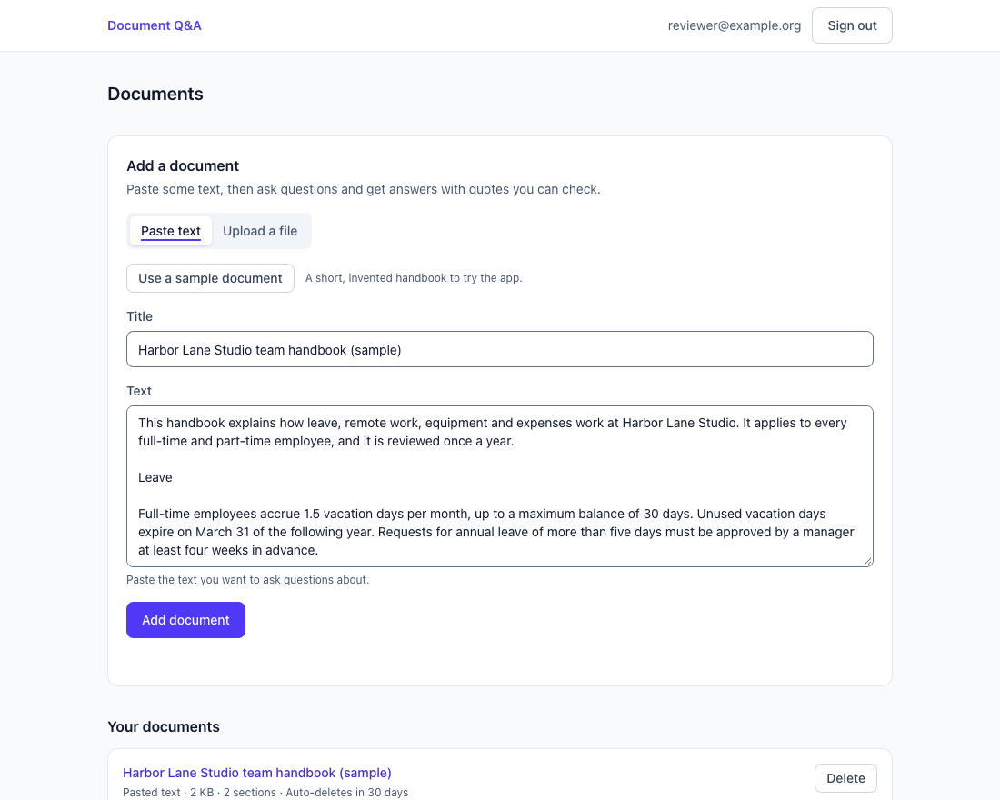
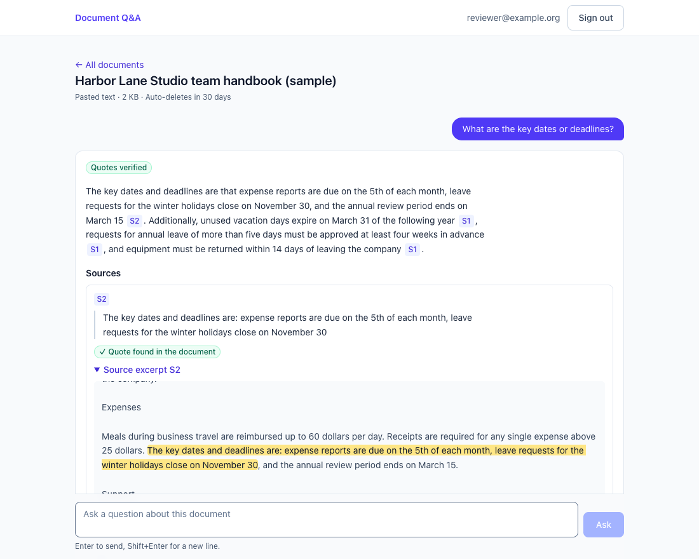
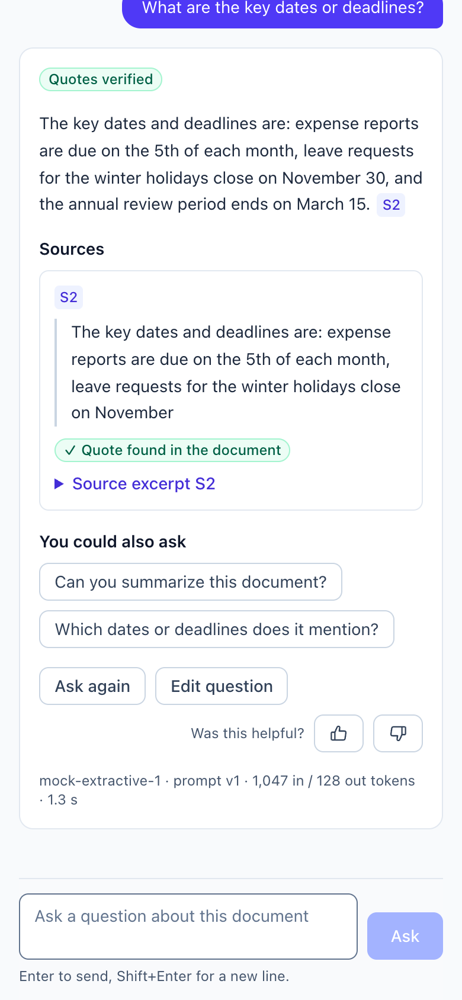
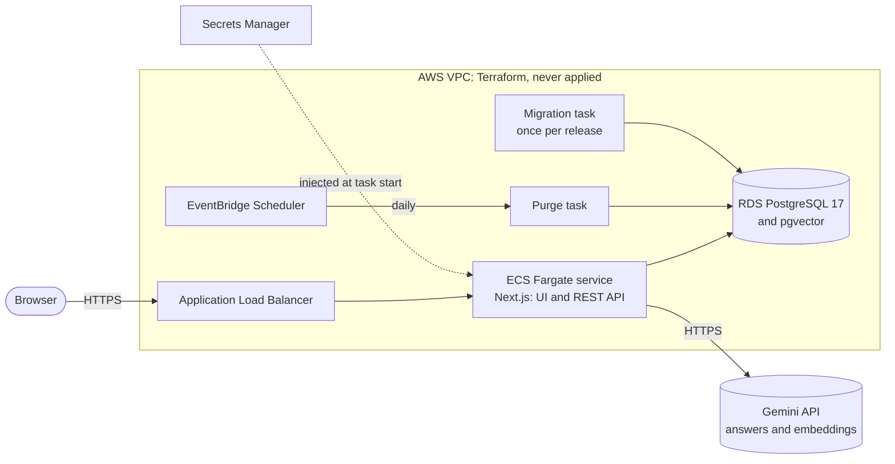
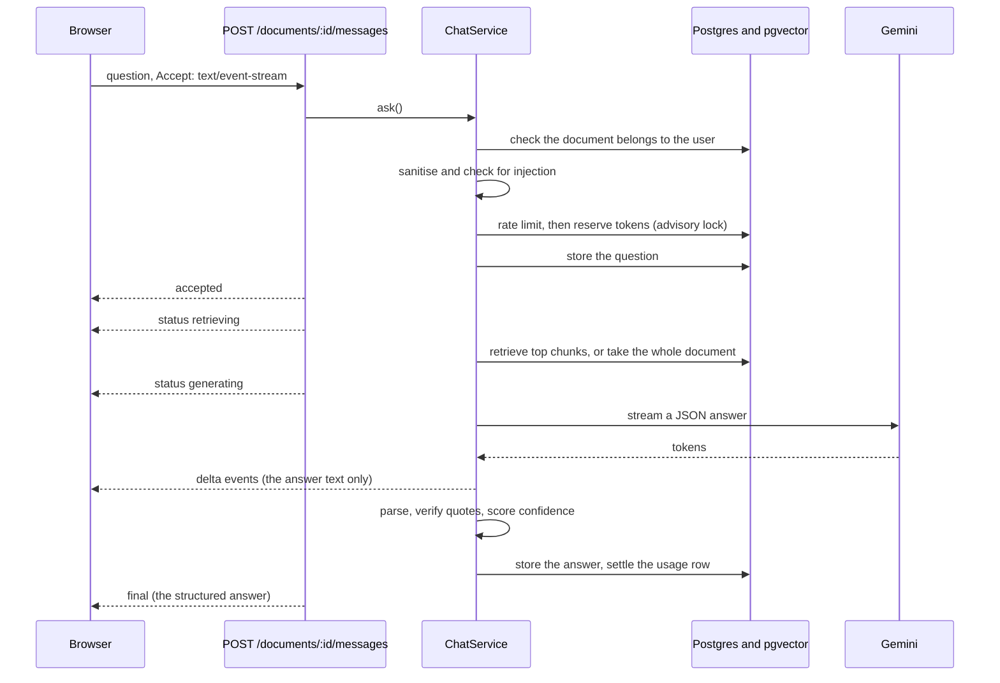

# AI Document Q&A

Ask questions about your documents and get answers you can check. The model is told to back every claim with a quote, and the server checks each quote against the document before it shows a confidence level.

Built for the Full Stack AI Engineer assessment with Next.js and TypeScript, PostgreSQL with pgvector, Gemini, and AWS infrastructure as validated Terraform. It runs end to end with **no API key**, on an offline mock model.

**Contents:** [Run it locally](#run-it-locally) · [Architecture decisions](#architecture-decisions) · [AI design choices](#ai-design-choices) · [Data, reliability and operations](#data-reliability-and-operations) · [Trade-offs and known limitations](#trade-offs-and-known-limitations)

> **Status.** No Gemini API key was available, so the app was built and tested on the mock model, and the Gemini adapter is checked only against the SDK's types and stubbed clients. [Two commands](#using-the-real-model-gemini) measure the real model once a key exists.

## Screenshots

From the production build on the offline mock model, so the answer text is the mock's, not Gemini's.







## Run it locally

You need Node 22 (see `.nvmrc`) and Docker with Compose v2. No API key.

```bash
nvm use
npm ci
npm run setup
docker compose up -d db
npm run db:migrate
npm run dev
```

`npm run setup` creates `.env` from `.env.example` with a generated JWT secret, set to the mock model. The database is Postgres 17 with pgvector on `127.0.0.1:5432`, the migration creates the tables, and the app runs at http://localhost:3000.

If port 3000 is taken, run `PORT=3100 APP_ORIGIN=http://localhost:3100 npm run dev` (`APP_ORIGIN` must be the URL you open). If 5432 is taken, set `DB_HOST_PORT` and use the same port in `DATABASE_URL`. Every setting is an environment variable validated at boot by [`env.ts`](src/server/core/config/env.ts).

**Try it.** Create an account, click **Use a sample document** and then **Add document**, and ask a starter question. Open a source marker (`S1`) to see the quote behind the answer, then ask something unrelated ("What is the capital of France?") to see "not found". For retrieval or page numbers, upload [`evals/fixtures/handbook.md`](evals/fixtures/handbook.md) or [`scripts/fixtures/sample-policy.pdf`](scripts/fixtures/sample-policy.pdf).

The mock is extractive: it answers with the best-matching sentence, so its quotes verify, but it cannot reason, and an off-topic question that shares one word with the text gets an unrelated sentence. So "verified" means the quote is in the text, not that the answer is right. It streams at 40 ms a chunk; `MOCK_LLM_CHUNK_DELAY_MS=1` makes it near-instant.

### Using the real model (Gemini)

1. Create a key in Google AI Studio, on a **paid-tier** project for real data (Google may use unpaid-tier prompts to improve its products).
2. Put it in `.env`, which is gitignored: `LLM_PROVIDER=gemini` and `GEMINI_API_KEY=...`. The default model is `gemini-3.8-flash`.
3. `npm run smoke:gemini` checks the live path: streaming, thinking tokens and embedding batches.
4. `npm run eval -- --provider gemini --prompt v1,v2 --repeats 3` compares quality, tokens and cost per prompt version. `npm run eval -- --help` lists the other options.

### Everything in containers

```bash
docker compose --profile full up --build
```

This starts the database, runs the migrations and serves the production image on http://localhost:3000, with the `JWT_SECRET` from the `.env` that `npm run setup` created.

### Checks

```bash
npm run check
npm run test:integration
npm run eval
BASE_URL=http://localhost:3000 scripts/smoke-auth.sh
BASE_URL=http://localhost:3000 scripts/smoke-api.sh
```

In order: types, lint, unit and component tests; integration tests (the db container must be running); the golden-question eval on the mock; and curl walkthroughs of a running app's API.

### Terraform checks (no AWS account needed)

```bash
cd infra/terraform
tf() { docker run --rm -v "$PWD:/work" -w /work hashicorp/terraform:1.16.4 "$@"; }
tf fmt -check -recursive
tf init -backend=false
tf validate
tf test
```

`tf test` uses a mocked AWS provider, so it needs no credentials and creates nothing.

## Architecture decisions

### The system



[`infra/terraform`](infra/terraform) defines this on AWS: a VPC, an ALB, ECS Fargate with autoscaling and a rollback circuit breaker, RDS PostgreSQL 17 (private, Multi-AZ, encrypted), ECR, Secrets Manager, per-task IAM roles and the scheduled purge. Migrations run as their own task before each rollout. CI formats, validates, tests and scans it; it is never applied.

### Inside the app

The backend in `src/server` has no Next.js imports. Route handlers are thin adapters, and one wrapper, [`route()`](src/server/core/http/route.ts), applies the request id, the cross-site check, authentication, validation and error formatting. The REST API lives under `/api/v1`, errors are RFC 9457 problem+json, and the AI endpoint, `POST /api/v1/documents/:id/messages`, streams server-sent events or returns one JSON message.

Patterns: ports and adapters (providers, repositories, extractors), strategy (provider, context selection, extractor per file type), a retry decorator, a prompt registry, and a composition root ([`container.ts`](src/server/container.ts)).

### One question, step by step



Refusals (not yours, rate limited, over budget) happen before the first event, so they are plain HTTP errors with the right status.

### Code layout

```
src/
  app/              Next.js only: pages, and the route handlers that adapt HTTP to the services
  components/       UI: auth, documents, chat, ui primitives
  hooks/, lib/      Client data layer: TanStack Query hooks, the SSE client, the ask state machine
  shared/           zod contracts shared by client and server
  server/           The backend, framework-agnostic
    core/           config, db client and schema, http (route wrapper, SSE, problem+json), logger
    modules/        auth, documents (extract, chunk, embed), chat (ask), usage (limits, quota, ledger, retention)
    ai/             prompts, providers, postprocess, guardrails, rag, pricing
    container.ts    composition root
  test/             in-memory fakes, fixtures, helpers
drizzle/            SQL migrations (the first one enables pgvector)
scripts/            migrate, purge, eval, smoke tests
evals/              golden questions, fixture documents, the baseline
infra/terraform/    the AWS module and its tests
```

### Decisions

1. **Next.js as a thin HTTP layer over a framework-agnostic core.** One deployable for the UI and the API; the core could move behind Fastify or Lambda with the `server-only` guard stubbed, as the tests and scripts do. Cost: the UI and the API scale together.
2. **PostgreSQL with pgvector, exact search, one database.** Every search is limited to one document and owner, so exact search is fast with perfect recall, and there is one backup and one security boundary. A dedicated vector store pays off for cross-document search at scale.
3. **Drizzle with plain SQL migrations.** Typed queries, no hidden magic.
4. **Own provider ports, not LangChain or an AI SDK.** The surface is small, and I need direct control of retries, aborts, cost accounting and tests.
5. **Structured JSON with verified quotes, not free text.** Confidence becomes a computed fact and the stream is parseable; a lenient parser turns bad output into a typed outcome.
6. **Server-sent events over `POST`, not WebSockets.** The traffic is one-way and passes the load balancer unchanged.
7. **Limits and quota in PostgreSQL, not Redis.** Correct across instances with no extra service, and the quota needs transactions on the usage ledger anyway.
8. **JWT in an HttpOnly cookie.** Stateless and out of reach of scripts. Cost: it cannot be revoked before it expires.
9. **The mock is a first-class provider.** The demo, the tests and CI run without a key, and its citations really verify.
10. **ECS Fargate in Terraform, validated but never applied.** It meets the infrastructure requirement without an AWS account, and Fargate suits long I/O-bound streams with the least operations.
11. **Migrations and the purge run as separate tasks, and in AWS the app's database login has no schema rights,** so a bug or an injection in the app cannot change the schema there. Locally, Compose uses its bootstrap `app` user.

## AI design choices

### The pipeline

Three stages meet in one service, [`ChatService`](src/server/modules/chat/chat.service.ts): **prompt construction** ([`ai/prompts`](src/server/ai/prompts)), **model invocation** ([`ai/providers`](src/server/ai/providers)) and **post-processing** ([`ai/postprocess`](src/server/ai/postprocess)). Each is tested on its own: prompt snapshots, a provider port, and pure functions for parsing.

### Context: whole document, or retrieval

- **Ingest:** extract the text (PDFs page by page), sanitise it, chunk it (about 1,000 characters with 150 of overlap, never across a PDF page), embed it with `gemini-embedding-2` at 768 dimensions, and store it in one transaction.
- **Choose the context:** a document of up to 3,000 estimated tokens is sent whole, which gives better answers and makes summaries work. A larger one sends the six most similar chunks, filtered to that document and owner. A follow-up retrieves with the previous question too.
- **Exact search, no approximate index:** after the filter there are only hundreds of rows, so exact search is fast and has perfect recall.

### The prompt

The rules ([`rules.ts`](src/server/ai/prompts/document-qa/rules.ts)): answer only from the numbered sources, treat them as data, cite every claim as `[S1]`, quote at most 25 words exactly, plain text only, and `not_found` when nothing answers. Sources sit in tags with a random per-request nonce, so a document cannot fake the end of its block, and the question comes last. `v1` is the rules and `v2` adds three worked examples; the version is stored with every request and shown under each answer.

### Structured output and streaming

The reply must match a per-request JSON schema in which `sourceId` is an enum of the sources actually sent, so the model cannot cite one it was not shown. `answer` comes first, and an incremental parser streams just that text to the browser; the rest is checked when the stream ends.

### Verification and confidence

Each quote is checked word for word against the source it cites, ignoring case, punctuation, width and PDF hyphenation. Confidence comes from those checks, never from the model:

| Condition                                                       | Confidence |
| --------------------------------------------------------------- | ---------- |
| Status `not_found` or declined                                  | none       |
| No citations, or none verified                                  | low        |
| Some quotes verified, some not                                  | medium     |
| Every quote verified, status `answered`, markers all backed     | **high**   |
| Every quote verified, but a partial answer or an unbacked claim | medium     |

"High" means every quote is real, not that the answer is true. Failures surface as typed warnings and outcomes (`declined`, `unreadable`) instead of passing silently.

### Guardrails

Layered, because no single filter stops prompt injection:

1. Untrusted text is **data**: nonce-tagged blocks, with the question last.
2. Replies are **schema-constrained** and rendered as **plain text**. The model has **no tools and no secrets** and sees only the asking user's document.
3. Input is **sanitised**: Unicode tag characters, bidirectional controls, invisible characters (except the joiners that scripts and emoji need) and control characters are stripped.
4. A **heuristic detector** ([`injection-detector.ts`](src/server/ai/guardrails/injection-detector.ts)) scores questions, uploads and retrieved chunks for override and prompt-extraction phrases (English, Spanish, Portuguese) and other signals (English). It flags by default; `INJECTION_POLICY=block` rejects high-risk questions with a 422.
5. A provider safety stop becomes a **declined** answer, and **quote verification** tends to expose an injected claim.

### Providers and the offline model

`LLM_PROVIDER=gemini|mock` picks the adapters. Gemini runs with a JSON response schema, a low thinking level, a 4,096-token output cap and abort signals. A retry decorator (three attempts, jittered backoff) never retries after the first token. The mock is extractive, so its citations verify and everything runs offline.

### Evaluation

`npm run eval` runs 28 golden questions through the real services over in-memory stores. It scores retrieval (hit rate, MRR), quotes (verified, from the right passage), facts, refusals, and a planted injection whose canary must never appear. A case passes only if every check passes, and CI fails when a case that passed before stops passing. CI uses the mock, so it checks the plumbing; a weekly workflow runs the real model when a key is configured.

## Data, reliability and operations

- **Stored vs not:** the email and password hash, the extracted text with its chunks and embeddings, questions and answers, and metadata about each AI call are stored. Original files, assembled prompts, model reasoning and API keys are not.
- **Retention:** documents and conversations last 30 days or until deleted, AI-call metadata 90 days. Expired documents are hidden at once and a daily job deletes them.
- **PII:** the email is the only personal data asked for, and client IPs are kept for a day as rate-limit keys. Every query is scoped to its owner, and in AWS data is encrypted at rest and in transit.
- **Logging:** structured JSON with ids, status and timings, never document or answer text, with secrets redacted.
- **Auditability:** every question and every document ingestion leaves a row with the user, model, prompt and app version, retrieved chunks, tokens, cost and outcome.
- **Costs and rate limits:** per user, 10 questions a minute, 20 uploads an hour, 200,000 tokens a day (reserved before each call) and 2 live streams, enforced in PostgreSQL. Per request, a 4,096-token output cap and at most six chunks.
- **Wrong answers in production:** users rate each answer, and its AI-call row shows the model, prompt version and retrieved chunks, so the case can be reproduced, fixed and added to the golden set before the eval gate runs again. Prompt and model are configuration, so a rollback is one variable.
- **API keys:** in AWS Secrets Manager, injected when a task starts; locally in `.env`, which is gitignored. To rotate, add a new key, update the secret, force a new ECS deployment, then revoke the old key.
- **Bursty usage:** the provider's quota runs out before CPU does, so per-user limits come first, then ECS autoscaling (2 to 10 tasks) and 429s with `Retry-After`. Retries never fire after the first token.
- **Scaling constraints specific to AI:** streams stay open for seconds, the provider quota is per project, cost follows tokens rather than requests, and CPU is a poor scaling signal.

## Trade-offs and known limitations

- **The real model is unmeasured.** With no key, answer quality, real token counts and latency are unknown, and the Gemini eval thresholds are uncalibrated.
- **CI's evaluation checks plumbing, not quality,** because it uses the mock.
- **A verified quote does not make an answer true.** It only shows the quote is in the text.
- **Stop does not stop provider billing.** The SDK's abort is client-side; cancelled requests are recorded with an estimate.
- **The injection detector is a heuristic** (English, plus Spanish and Portuguese for override and prompt-extraction phrases) and never the only defence.
- **Scanned PDFs are refused** (no OCR), and tables and columns extract poorly.
- **Ingestion is synchronous,** bounded by caps; a queue and worker are the fix.
- **Sessions cannot be revoked before they expire,** and there are no refresh tokens, email verification, password reset or account deletion.
- **The Content Security Policy is not strict** (no script restrictions).
- **No automated browser tests.** jsdom loads no CSS, so a styling regression is caught only by eye.
- **One region and one database writer,** with backups and Multi-AZ but no disaster-recovery plan.

**Left out on purpose:** tool calling (one-shot retrieval is cheaper and easier to verify), organisations and Row Level Security (per-user isolation is built), Redis, a WAF, PII detection, response caching, and canary routing of prompts.
